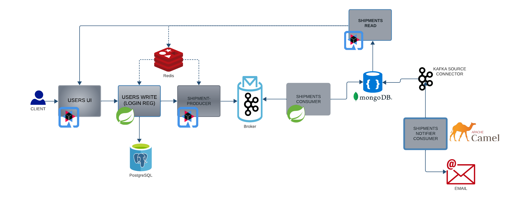
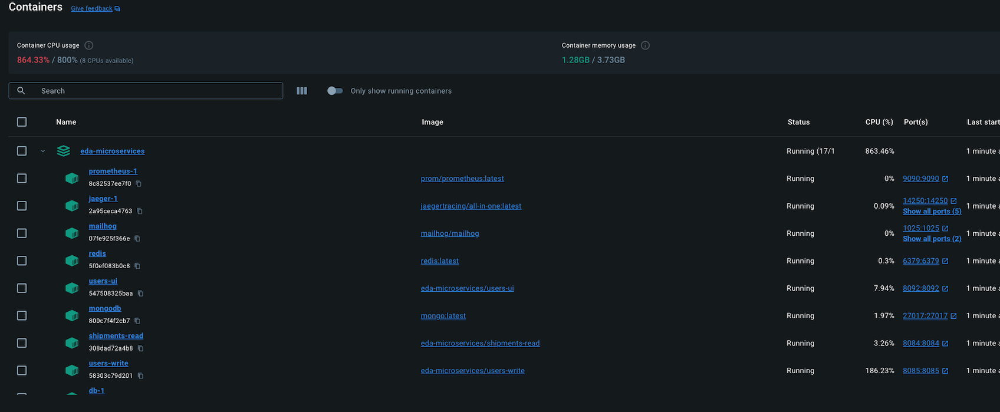
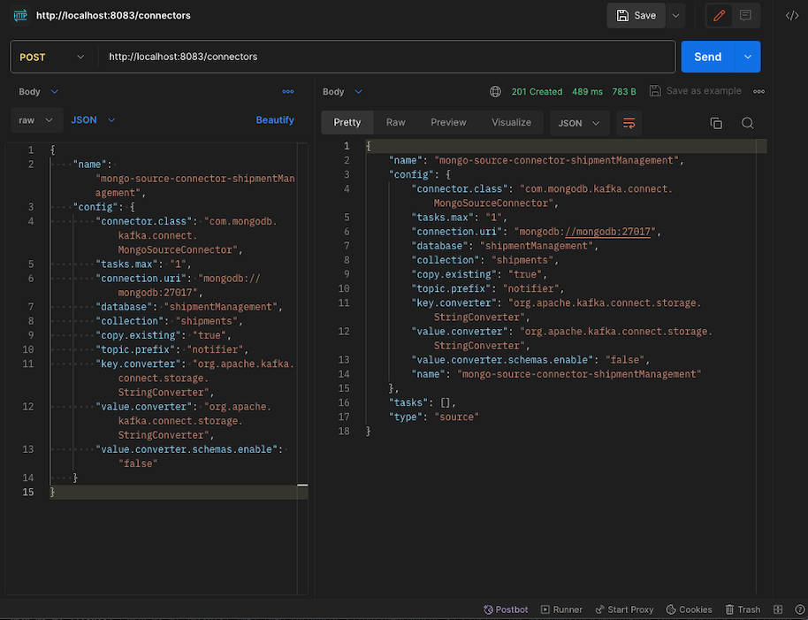
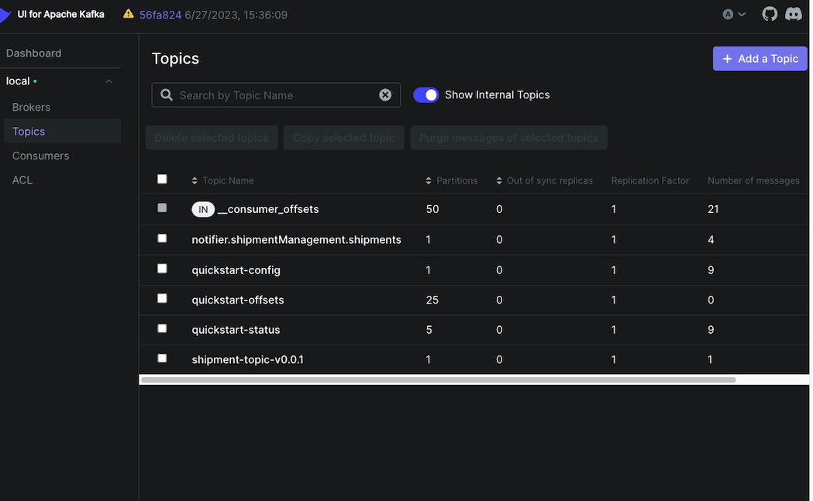
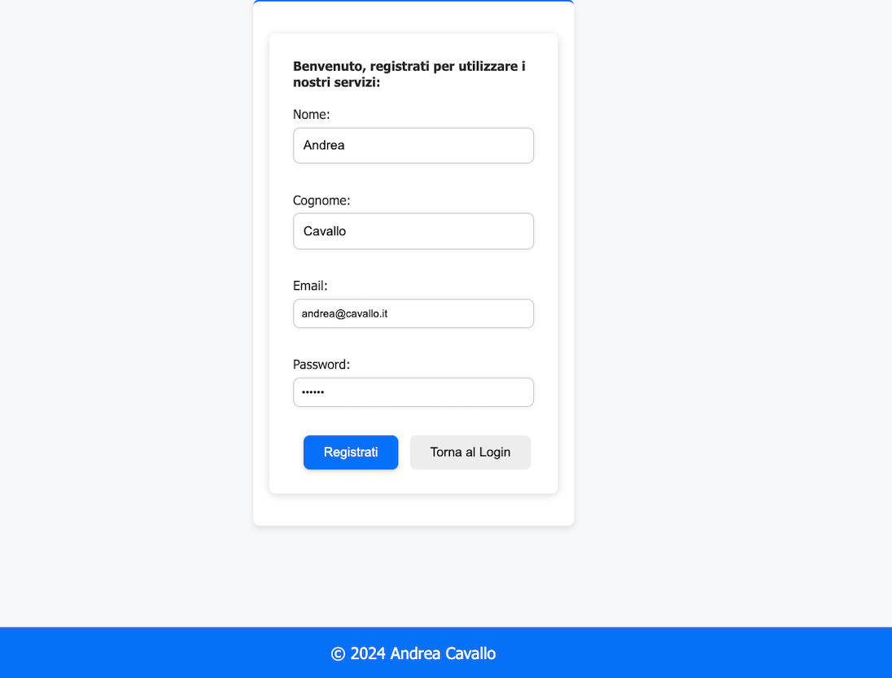
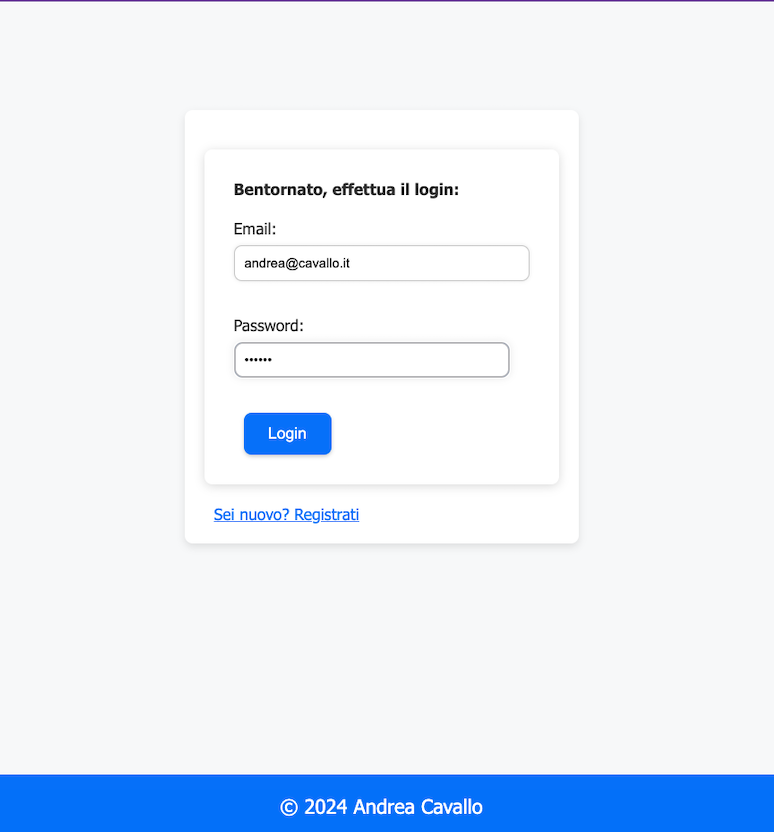
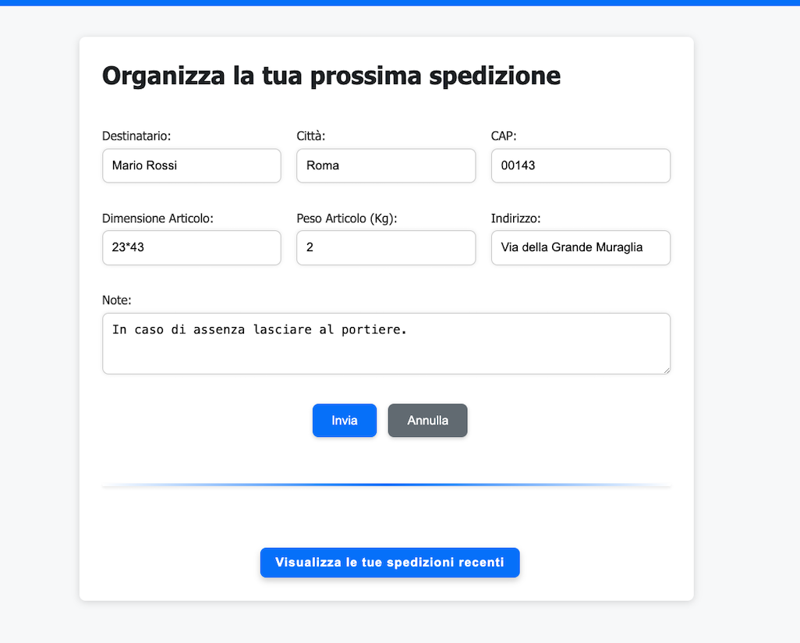
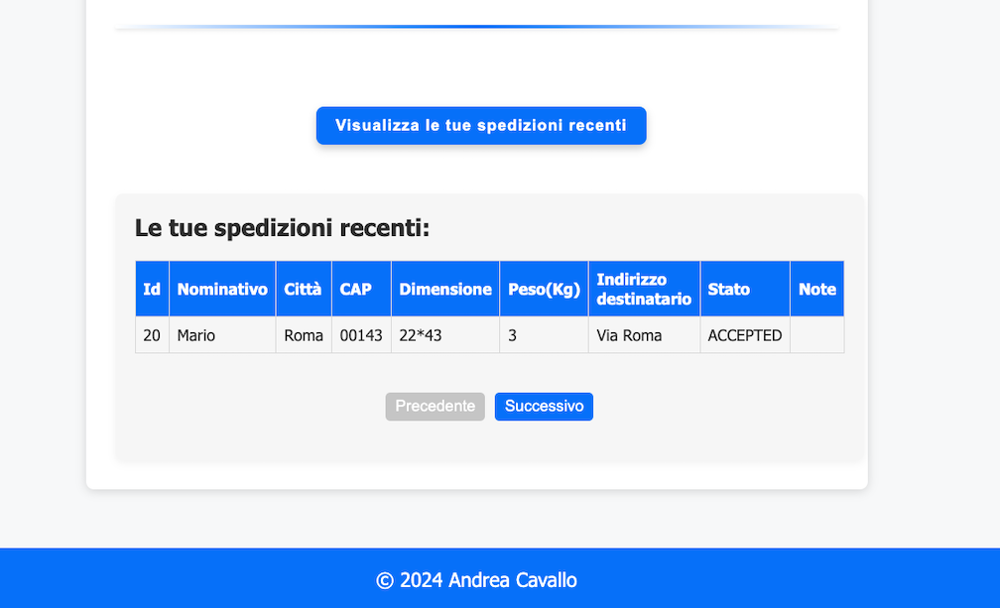

# Event-Driven Microservices Architecture Overview

This repository provides a comprehensive example of an event-driven microservices architecture designed for efficient order management. It leverages technologies such as Kafka, MongoDB, Redis, PostgreSQL, Quarkus, Spring Boot, and Apache Camel to create a scalable, reliable, and reactive system.



## Key Components

- **Client**: The user interface or client application that interacts with the system.
- **Users UI**: A user interface developed with the Quarkus framework.
- **Users Write (Login Reg)**: A microservice responsible for handling user registration and login. It persists user credentials and session data to a PostgreSQL database.
- **Redis**: Utilized for caching and validating user session data after login for enhanced performance and session management.
- **Shipment Producer**: After login validation, this service is responsible for processing order creation requests. Once an order is processed, it publishes an event to a Kafka topic.
- **Kafka Broker**: A message broker that facilitates the publication and subscription of events in a distributed system.
- **Shipments Consumer (Spring Boot Microservice)**: Subscribes to the Kafka topic to consume order events and writes the data to a MongoDB database.
- **MongoDB**: A NoSQL database that stores shipment data.
- **Kafka Source Connector**: Attached to MongoDB, it captures changes and publishes them to another Kafka topic.
- **Shipments Notifier Consumer (Apache Camel)**: Consumes messages from the Kafka topic and triggers email notifications.
- **Shipments Read**: This microservice implements the CQRS (Command Query Responsibility Segregation) pattern and is solely responsible for exposing read-only queries to fetch data from MongoDB.

## Workflow

1. The **client** interacts with the **Users UI** to perform operations such as registration and login.
2. Upon successful login, the **Users Write** service writes the user data to **PostgreSQL** and the session is validated using **Redis**.
3. Post-validation, the client can initiate an order which triggers the **Shipment Producer** to create an order and publish an event to the Kafka topic.
4. The **Shipments Consumer** service, built with Spring Boot, consumes the event from the Kafka topic and updates **MongoDB** with the shipment data.
5. Changes in MongoDB are captured by the **Kafka Source Connector** and published to another topic, which is then consumed by the **Shipments Notifier Consumer**.
6. The **Shipments Notifier Consumer**, using Apache Camel, processes the consumed event and sends out an email notification.
7. Additionally, the **Shipments Read** service provides read-only access to shipment data, adhering to the CQRS pattern for separating read operations from write operations.

## Considerations

- The use of **Redis** for session validation post-login ensures that subsequent user operations are fast and efficient.
- The **Kafka Source Connector** allows for decoupling the system components, providing flexibility in the data flow and enabling real-time data synchronization.
- **Apache Camel** is used for routing and mediation rules, simplifying integration with email services for notifications.
- The **CQRS** pattern enhances the system's scalability and performance by segregating the read and write operations.

## Starting Services with Docker Compose

he system utilizes a range of Docker images to create the microservices environment:

- `confluentinc/cp-zookeeper`: Used for managing Kafka's state and metadata.
- `confluentinc/cp-kafka`: The Kafka broker itself, responsible for message storage and delivery.
- `provectuslabs/kafka-ui`: A web interface for Kafka, providing visual management and monitoring.
- `jaegertracing/all-in-one`: Jaeger, an open-source tracing system for monitoring and troubleshooting microservices-based distributed systems.
- `prom/prometheus`: The Prometheus monitoring system and time series database.
- `redis`: An in-memory database used for caching and session storage.
- `postgres`: The PostgreSQL database used for user data persistence.
- `dpage/pgadmin4`: A web-based administration tool for PostgreSQL.
- `mailhog/mailhog`: An email testing tool with a fake SMTP server.
- `mongo`: The MongoDB NoSQL database for storing shipment data.



Each service in the `docker-compose.yml` file is built from a specific context or image and is dependent on other services like `kafka`, `zookeeper`, `mongodb`, and `mailhog` to function properly.

## Custom Service Images

The custom services like `shipments-producer`, `shipments-read`, `users-write`, `shipments-consumer-write`, `shipments-notifier-consumer`, and `users-ui` are built from the respective directories with Dockerfiles. These services are tagged with the `eda-microservices` prefix and are linked to the above-mentioned dependencies.

To start all the services defined in the architecture, make sure Docker and Docker Compose are installed on your system and use the following command:

```bash
docker-compose -f docker-compose-all.yml build
```

```bash
docker-compose -f docker-compose-all.yml up
```

## Enabling Replica Set in MongoDB for Kafka Connector

The Kafka Connect source and sink connectors require MongoDB to be running as a replica set. Even if you have only a single node of MongoDB, it still needs to be configured as a replica set for the connectors to work.

Here are the steps to enable a replica set in MongoDB:

1. **Access the MongoDB Docker Container**:
   Use the following command to access the running MongoDB container:

   ```bash
   docker exec -it <mongodb_container_name> bash
   ```

   Replace `<mongodb_container_name>` with the actual name of your MongoDB container.

2. **Access the MongoDB Shell**:
   Once inside the container, access the MongoDB shell by executing:

   ```bash
   mongosh
   ```

3. **Connect to the Admin Database**:
   In the MongoDB shell, switch to the admin database:

   ```javascript
   use admin
   ```

4. **Initialize the Replica Set**:
   To initialize a replica set, execute the following command:

   ```javascript
   rs.initiate();
   ```

   This command will configure MongoDB to start as a replica set with the current node as the primary.

   After executing these commands, MongoDB will function as a replica set, allowing you to configure the Kafka Connector to interact with MongoDB.

   You will find the cURL command in the main root of the project in kafka-source-connector.json, which will register the connector:



Afterward, you can also view the topic correctly created by Kafka-UI.
In this case, the topic name you find is based on the prefix I have chosen in the connector, infact final name is: [prefixName.dbName.collectionName]



## Application Interface Screenshots

Below are some screenshots that showcase various aspects of the application's user interface:

### SignUp Page

Here is where users can enter their credentials to sign-up.



### Login Page

Here is where users can enter their credentials to log in to the application.



### Shipment Management

This section allows users to manage their shipments, track statuses.





### Technologies Used

- Quarkus
- MongoDB
- Redis
- Postgres
- Apache Kafka
- Apache Camel
- JavaScript
- HTML
- CSS
- Spring Boot
- Java 17
- Maven

### Author


[Andrea Cavallo] - [a.cavallo@outlook.it]
